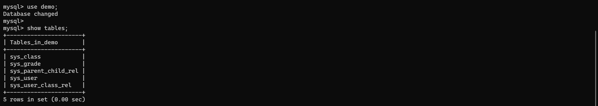
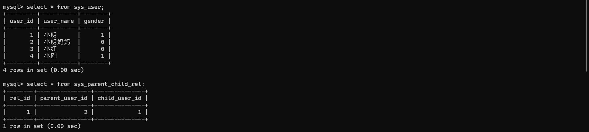
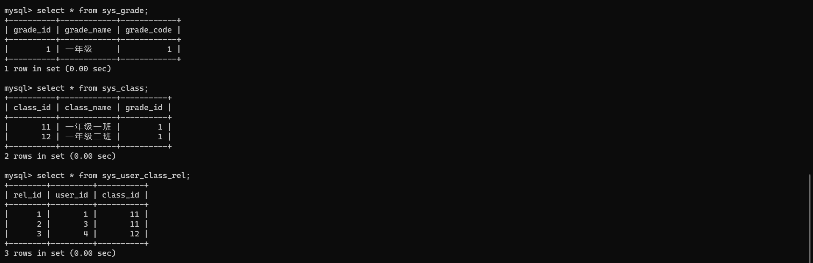
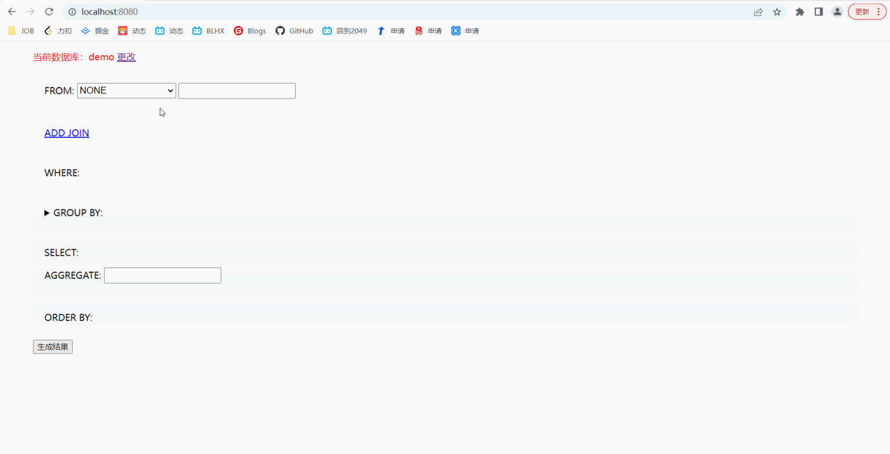

# sql-gen：点击生成SQL、RO、VO的工具

## 1. 概述

sql-gen是一个用于**提高后端接口开发效率**的小工具，主要有如下功能：
1. 生成**连表SQL语句**
2. 根据WHERE条件来生成**封装查询条件的实体类（RO）**
3. 根据SELECT列来生成**封装查询结果的实体类（VO）**

sql-gen主要有如下特点：
1. 自动生成表的别名（相关接口：`TableAliasGenerator`）
2. 自动推断主表和从表的连接条件，即ON语句（相关接口：`JoinColumnDeducer`）
3. 自动生成列的别名，解决SELECT和WHERE列中的名称重复问题（相关接口：`ColumnAliasGenerator`）

## 2. 演示

### 2.1. 数据库准备

数据库中总共有5张表，如下：
1. sys_class：班级表
2. sys_grade：年级表
3. sys_user：用户表，用于存放学生和家长
4. sys_user_class_rel：学生和班级的关联关系表
5. sys_parent_child_rel：学生和家长的关联关系表

sys_user表和sys_parent_child_rel表的具体内容如下：
1. 总共有4个用户
2. 小明妈妈是小明的家长

另外3张表的具体内容如下：
1. 一年级的id为`1`
2. 一年级下有一班和二班，其id分别为`11`和`12`
3. 小明和小红在一班，小刚在二班

### 2.2. 连表查询（一）

> 查询id为`1`的用户（即小明）的学生信息，包括用户信息、班级信息和年级信息

1. 此时需要连接sys_user、sys_user_class_rel、sys_class和sys_grade表
2. 并且要以sys_user表的user_id列作为查询条件

可以看出，sql-gen默认会将主表和从表中名称相同的列作为连接的条件

### 2.3. 连表查询（二）

> 查询id为`1`的用户（即小明）及其家长的信息

1. 此时需要连接sys_user、sys_parent_child_rel、sys_user表
2. sys_user表出现了两次，第一次是作为学生表，第二次是作为家长表
3. 然后以学生表的user_id列作为查询条件即可

可以看出，sql-gen还支持`child.user_id=xxx.child_user_id`形式的连接条件

### 2.4. 聚合查询

> 查询所有班级各自的学生人数

1. 此时需要连接sys_user、sys_user_class_rel、sys_class表
2. 并且，需要将sys_class表的class_id列作为GROUP BY列
3. sql-gen暂不支持通过点击的方式来指定聚合查询的列，需要用户手动在输入框中指定

